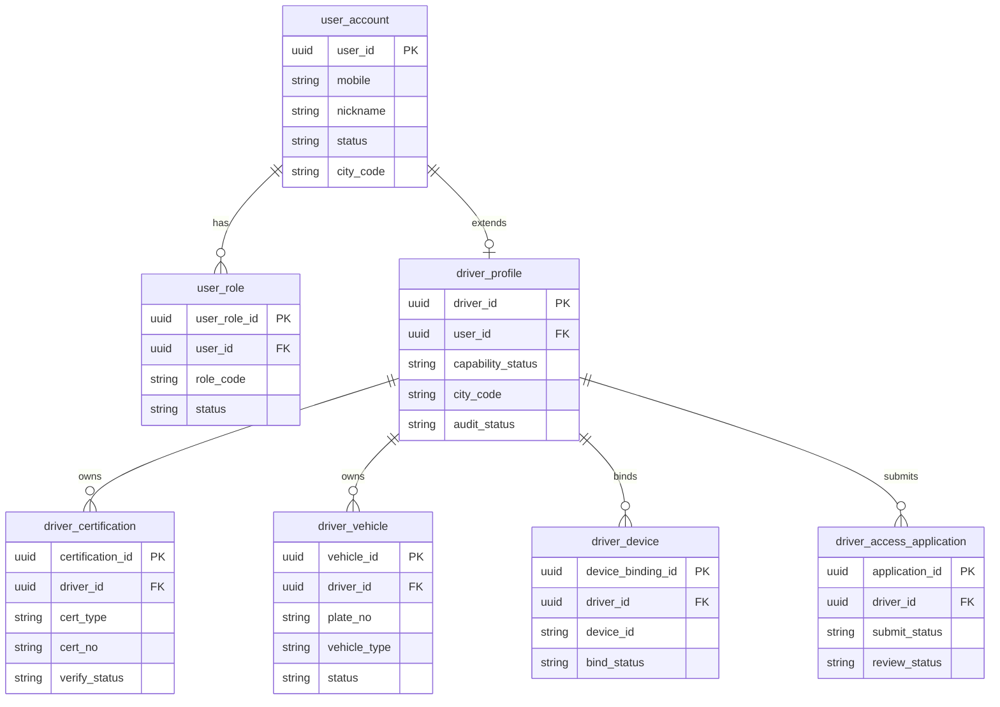
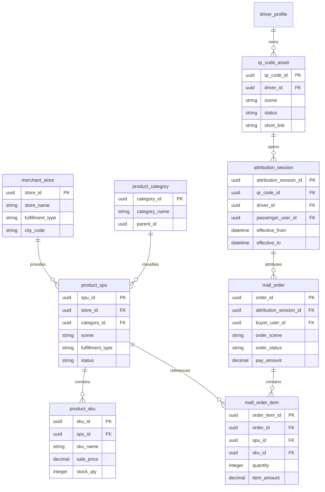
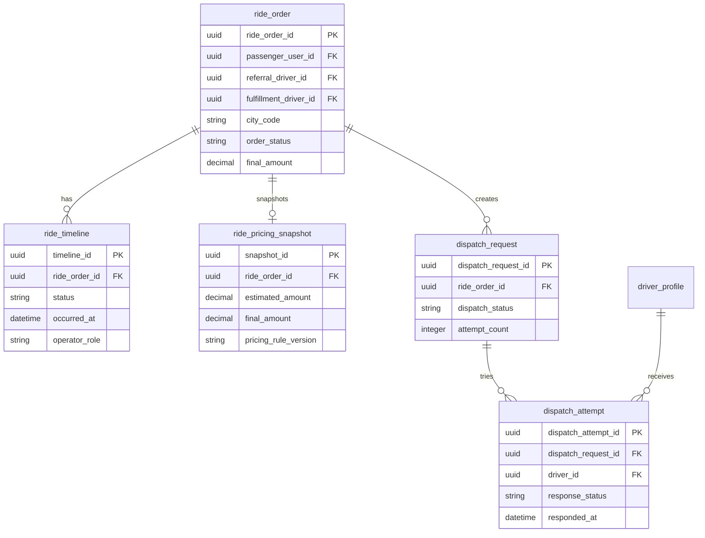
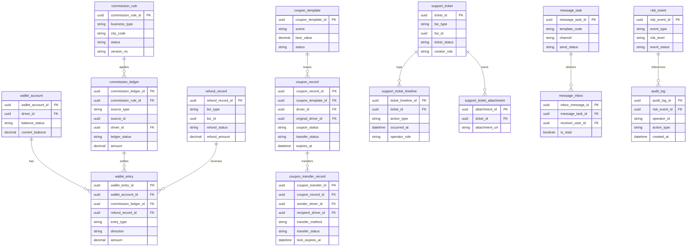
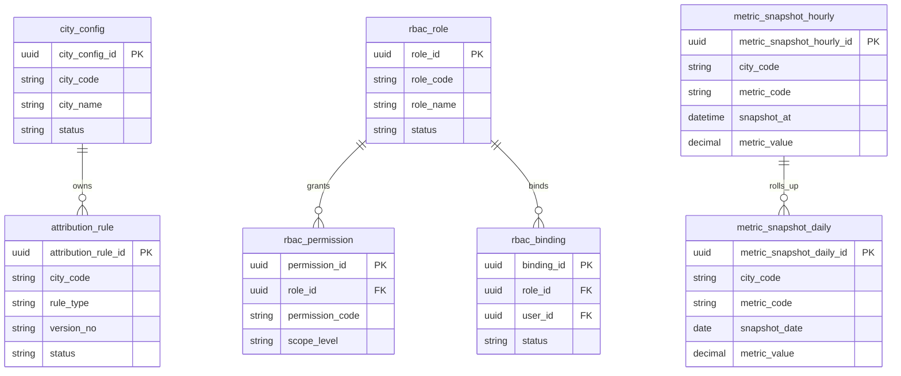

# 数据库 ER 图

**项目名称：** 千乘坊（ride-loop）  
**文档状态：** 草稿  
**负责人：** AI 软件工厂  
**主要读者：** 架构 | 后端 | DBA | 测试  
**上游输入：** 数据设计 | 系统详细设计 | 接口与契约设计  
**下游输出：** 迁移设计 | 仓储实现 | 对账校验  
**最后更新：** 2026-03-29  

## 1. Schema 划分

- `identity`：账户、角色、司机档案、司机准入
- `commerce`：商品、二维码、归因会话、商城/司机专区订单
- `ride`：叫车订单、时间线、派单请求、派单尝试
- `finance`：佣金规则、钱包、券、退款
- `support`：工单与申诉
- `message`：消息任务与站内收件箱
- `risk`：风险事件与审计日志
- `ops`：城市配置、归因规则、RBAC
- `analytics`：指标快照与聚合视图

## 2. 账户与司机准入域

## 3. 商品、归因与商城域

## 4. 出行与调度域

## 5. 资金、工单、消息与风控域

## 6. 运营与分析域

## 7. 说明

- `wallet_account.current_balance` 是缓存字段，真实余额以 `wallet_entry` 聚合为准。
- `mall_order.order_scene` 区分普通商城与司机专区。
- `ride_order.referral_driver_id` 和 `ride_order.fulfillment_driver_id` 允许不同。
- `audit_log` 既用于合规审计，也为后台动作级权限操作提供责任链。

## 8. 变更记录

| 日期 | 变更内容 | 变更人 |
|---|---|---|
| 2026-03-29 | 初始版本 | AI 软件工厂 |
| 2026-03-29 | 补充多域 ER 图与跨域关系 | AI 软件工厂 |
| 2026-03-29 | 补充返现券转赠实体与资金域关系 | AI 软件工厂 |
