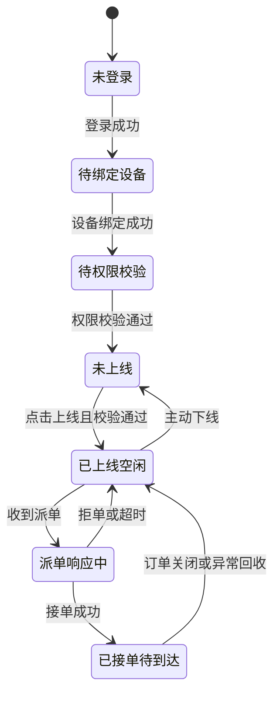
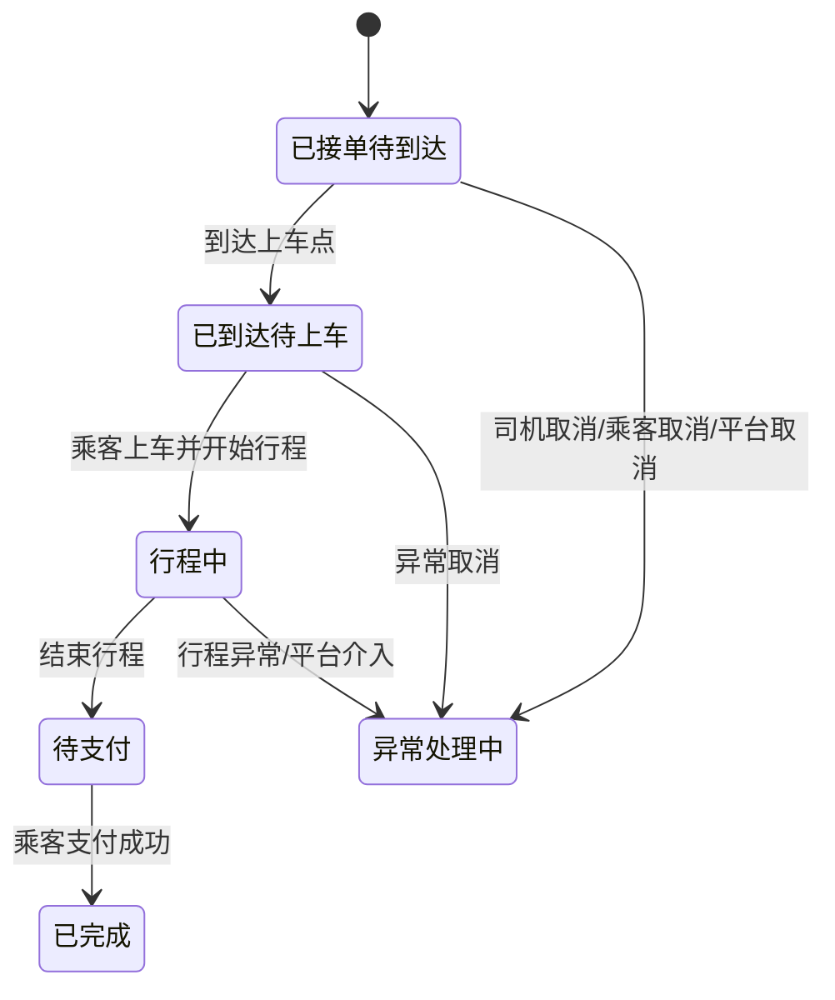

# 司机重端设计

**项目名称：** 千乘坊（ride-loop）  
**文档状态：** 草稿  
**负责人：** AI 软件工厂  
**主要读者：** 产品 | 架构 | Android | 后端 | 调度 | 测试  
**上游输入：** 端形态与渠道策略 | PRD | 接口与契约设计  
**下游输出：** 司机 App 原型 | 调度联调清单 | 行程状态机  
**关联 ID：** `REQ-007`, `REQ-008`, `REQ-009`, `REQ-013`, `REQ-014`, `REQ-015`, `UI-DRV-H-001` - `UI-DRV-H-012`, `API-001`, `API-005`, `API-009`, `API-018`, `API-029`, `API-030` - `API-038`, `API-064`, `API-065`  
**最后更新：** 2026-03-29  

## 1. 端目标

- 承接司机履约能力，而不是分销经营能力。
- 让司机在最少步骤里完成上线接单、接收派单、执行行程和异常上报。
- 作为高可靠运行端，负责设备绑定、在线状态、心跳和派单响应。

## 2. 适用边界

- 放在司机重端的能力：
  - 设备绑定与运行时校验
  - 上下线、在线心跳、定位上报
  - 派单接收、接单、拒单、超时处理
  - 行程状态推进
  - 行程异常上报和履约申诉
- 不放在司机重端的能力：
  - 分销二维码经营
  - 站内余额消费与司机专区购物
  - 复杂财务台账浏览

## 3. 信息架构

- 启动与设备绑定
- 权限引导
- 接单工作台
- 派单弹层与派单详情
- 当前行程
- 行程异常
- 历史订单
- 消息中心
- 账户与设备
- 系统设置

## 4. 页面清单

| 页面 ID | 页面名称 | 路由建议 | 可见角色状态 | 页面目标 | 优先级 |
|---|---|---|---|---|---|
| `UI-DRV-H-001` | 登录与设备绑定页 | `/driver-app/auth/login` | 全量司机 | 登录、设备绑定、同步司机当前状态 | P0 |
| `UI-DRV-H-002` | 权限引导页 | `/driver-app/auth/permissions` | 已登录未完成权限校验 | 申请定位、通知、后台运行等权限 | P0 |
| `UI-DRV-H-003` | 接单工作台 | `/driver-app/home` | 审核通过且设备可用 | 上下线、查看当前状态、查看在途订单 | P0 |
| `UI-DRV-H-004` | 派单弹层/详情 | `/driver-app/dispatch/detail` | 已上线收到派单 | 接单、拒单、查看倒计时和乘客信息 | P0 |
| `UI-DRV-H-005` | 当前行程页 | `/driver-app/trip/current` | 已接单或行程中 | 到达、开始、结束、联系乘客 | P0 |
| `UI-DRV-H-006` | 行程异常页 | `/driver-app/trip/exception` | 当前有进行中订单 | 上报异常、取消、申请平台介入 | P0 |
| `UI-DRV-H-007` | 历史订单页 | `/driver-app/orders/history` | 已登录司机 | 查看历史行程、状态与结算摘要 | P1 |
| `UI-DRV-H-008` | 订单详情页 | `/driver-app/orders/detail` | 已登录司机 | 查看轨迹、状态时间线、申诉入口 | P1 |
| `UI-DRV-H-009` | 消息中心页 | `/driver-app/messages` | 已登录司机 | 查看派单外消息、系统通知、工单反馈 | P1 |
| `UI-DRV-H-010` | 申诉页 | `/driver-app/support/appeal` | 有异常订单或已完单 | 发起履约申诉或补充材料 | P1 |
| `UI-DRV-H-011` | 账户与设备页 | `/driver-app/account` | 已登录司机 | 查看司机身份、设备绑定、版本信息 | P1 |
| `UI-DRV-H-012` | 系统设置页 | `/driver-app/settings` | 已登录司机 | 设置语音播报、接单偏好、通知提醒 | P1 |

## 5. 页面职责分解

| 页面 ID | 核心模块 | 主操作 | 前置条件 | 空态/异常态 |
|---|---|---|---|---|
| `UI-DRV-H-001` | 登录、设备指纹、版本检查、环境校验 | 登录、绑定设备、触发运行时初始化 | 司机身份存在 | 版本过低强制升级；账号异常禁止进入工作台 |
| `UI-DRV-H-002` | 权限说明、系统跳转、校验结果 | 授权定位、授权通知、允许后台运行 | 已登录 | 任一关键权限未授权时不可上线 |
| `UI-DRV-H-003` | 上线开关、当前状态、在途订单卡、系统告警 | 上线、下线、进入当前行程、查看派单异常 | 审核通过、设备绑定通过、权限通过 | 审核未通过、权限不足、设备异常均阻止上线 |
| `UI-DRV-H-004` | 倒计时、乘客信息、起终点、预估收入 | 接单、拒单、查看详情 | 已上线且收到待响应派单 | 超时自动关闭；订单被他人接走时展示失效提示 |
| `UI-DRV-H-005` | 行程状态卡、导航入口、联系乘客、费用摘要 | 到达、开始行程、结束行程、联系乘客、异常上报 | 当前存在唯一活动行程 | 非法状态推进时按钮禁用并给出原因 |
| `UI-DRV-H-006` | 异常类型、文本说明、图片凭证、平台介入 | 上报异常、申请取消、补充证据 | 当前有活动行程 | 同一阶段重复上报时提示工单已存在 |
| `UI-DRV-H-007` | 订单列表、筛选、汇总信息 | 按日期筛选、按状态筛选、查看详情 | 已登录司机 | 无订单时显示引导，不显示空白页 |
| `UI-DRV-H-008` | 轨迹时间线、状态快照、判责结果、申诉入口 | 查看明细、复制订单号、去申诉 | 订单存在且属于本人 | 被删除或无权限订单只显示错误页 |
| `UI-DRV-H-009` | 系统消息、异常处理结果、版本提醒 | 查看消息、跳转业务页面 | 已登录司机 | 无消息时展示通知说明 |
| `UI-DRV-H-010` | 工单表单、附件上传、结论回看 | 创建申诉、补充证据 | 订单允许申诉 | 超过申诉时效时只允许查看历史结论 |
| `UI-DRV-H-011` | 司机资料、设备信息、版本号、绑定状态 | 查看当前绑定设备、申请换绑 | 已登录司机 | 换绑需进入人工审核或验证码流程 |
| `UI-DRV-H-012` | 语音播报、接单偏好、通知偏好 | 打开/关闭语音、设置偏好 | 已登录司机 | 偏好修改失败不影响当前接单状态 |

## 6. 状态流转

### 6.1 运行时总状态

| 状态码 | 状态名称 | 含义 | 可见页面 |
|---|---|---|---|
| `DRV-H-S01` | 未登录 | 尚未完成登录初始化 | `UI-DRV-H-001` |
| `DRV-H-S02` | 待绑定设备 | 登录后未完成设备绑定 | `UI-DRV-H-001` |
| `DRV-H-S03` | 待权限校验 | 已绑定设备但权限不足 | `UI-DRV-H-002` |
| `DRV-H-S04` | 未上线 | 可进入工作台但当前不接单 | `UI-DRV-H-003` |
| `DRV-H-S05` | 已上线空闲 | 可接收派单 | `UI-DRV-H-003` |
| `DRV-H-S06` | 派单响应中 | 正在等待司机响应派单 | `UI-DRV-H-004` |
| `DRV-H-S07` | 已接单待到达 | 已接单，前往上车点 | `UI-DRV-H-005` |
| `DRV-H-S08` | 已到达待上车 | 已到达上车点，等待乘客上车 | `UI-DRV-H-005` |
| `DRV-H-S09` | 行程中 | 乘客已上车，行程进行中 | `UI-DRV-H-005` |
| `DRV-H-S10` | 待支付 | 行程结束，等待支付完成 | `UI-DRV-H-005` |
| `DRV-H-S11` | 异常处理中 | 订单被取消或异常待平台判定 | `UI-DRV-H-006/010` |
| `DRV-H-S12` | 账号受限 | 审核未通过、被暂停或被封禁 | `UI-DRV-H-001/003` |

### 6.2 上线接单流

| 触发动作 | 来源状态 | 目标状态 | 前置校验 | 阻断原因 |
|---|---|---|---|---|
| 设备绑定 | `DRV-H-S02` | `DRV-H-S03` | 设备指纹、司机身份一致 | 同账号在其他设备登录且未解绑 |
| 完成权限授权 | `DRV-H-S03` | `DRV-H-S04` | 定位、通知、后台运行达标 | 任一关键权限缺失 |
| 点击上线 | `DRV-H-S04` | `DRV-H-S05` | 司机审核通过、无在途禁令、设备健康 | 司机被暂停、定位异常、版本过旧 |
| 接单 | `DRV-H-S06` | `DRV-H-S07` | 派单仍有效且未被他人接走 | 派单超时、派单已失效 |
| 主动下线 | `DRV-H-S05` | `DRV-H-S04` | 无在途订单 | 有在途订单时不允许下线 |

### 6.3 行程状态流

| 状态推进动作 | 来源状态 | 目标状态 | 行为方 | 关键约束 |
|---|---|---|---|---|
| 到达上车点 | `DRV-H-S07` | `DRV-H-S08` | 司机 | 必须有定位校验或人工豁免 |
| 开始行程 | `DRV-H-S08` | `DRV-H-S09` | 司机 | 不允许从已接单直接跳到行程中 |
| 结束行程 | `DRV-H-S09` | `DRV-H-S10` | 司机 | 必须记录结束时间和位置 |
| 支付完成 | `DRV-H-S10` | 已完成 | 支付系统回写 | 由后端驱动，司机端只读更新 |
| 异常取消 | `DRV-H-S07/08/09` | `DRV-H-S11` | 司机/乘客/平台 | 必须保留取消责任方和原因 |

### 6.4 异常与申诉流

| 异常场景 | 提交入口 | 处理服务 | 重端动作 |
|---|---|---|---|
| 乘客联系不上 | `UI-DRV-H-006` | `support-service` | 允许上报并继续等待或申请取消 |
| 乘客拒绝上车 | `UI-DRV-H-006` | `support-service` | 允许上报取消并留痕 |
| 途中改派/平台介入 | `UI-DRV-H-006` | `dispatch-engine + ride-order` | 展示平台介入状态，不允许司机本地改单 |
| 完单后判责争议 | `UI-DRV-H-010` | `support-service` | 允许在时效内发起申诉 |

## 7. 接口清单

### 7.1 接口明细

| 接口 ID | 方法 | 路径 | 页面/流程 | 请求核心字段 | 响应核心字段 | 权限与约束 |
|---|---|---|---|---|---|---|
| `API-001` | `POST` | `/api/v1/auth/session` | `UI-DRV-H-001` | `phoneOrWxToken`, `clientType=driver-app` | `sessionToken`, `userId`, `roles` | 登录成功后再进入重端启动初始化 |
| `API-005` | `GET` | `/api/v1/me/profile` | `UI-DRV-H-001/011` | `sessionToken` | `driverId`, `roles`, `driverCapabilityStatus` | 决定是否允许进入重端主流程 |
| `API-030` | `POST` | `/api/v1/driver-app/session/bootstrap` | `UI-DRV-H-001` | `deviceId`, `appVersion`, `osVersion`, `pushToken` | `driverStatus`, `bindStatus`, `permissionChecklist`, `activeTrip`, `forceUpgrade` | 启动初始化接口，必须先于其他运行时接口调用 |
| `API-031` | `POST` | `/api/v1/driver-app/devices/bind` | `UI-DRV-H-001` | `deviceId`, `deviceFingerprint`, `smsCode` 或 `reviewToken` | `bindStatus`, `boundAt`, `replaceRequired` | 同一司机同一时刻只允许一个主设备 |
| `API-032` | `POST` | `/api/v1/driver-app/runtime/status` | `UI-DRV-H-003` | `targetStatus`, `deviceId`, `locationSnapshot` | `runtimeStatus`, `effectiveAt`, `blockReason` | 上线前要完成审核、权限和设备校验 |
| `API-033` | `POST` | `/api/v1/driver-app/runtime/heartbeat` | 后台任务 | `deviceId`, `runtimeStatus`, `location`, `battery`, `networkType` | `serverTime`, `dispatchHint`, `healthWarnings[]` | 心跳失败达到阈值后自动置为不可靠在线 |
| `API-034` | `GET` | `/api/v1/driver-app/dispatch/current` | `UI-DRV-H-004` | `deviceId` | `dispatchId`, `pickup`, `destination`, `countdown`, `estimatedIncome` | 仅在待响应派单期间返回有效对象 |
| `API-035` | `POST` | `/api/v1/driver-app/dispatch/{dispatchId}/actions` | `UI-DRV-H-004` | `action=accept/reject/timeoutAck`, `reason`, `deviceId` | `dispatchStatus`, `tripId`, `nextRuntimeStatus` | 接单动作必须幂等，超时回执由客户端补写 |
| `API-036` | `POST` | `/api/v1/driver-app/trips/{tripId}/status` | `UI-DRV-H-005` | `action=arrive/start/finish`, `location`, `occurredAt` | `tripStatus`, `timeline[]`, `nextAllowedActions[]` | 非法状态迁移返回 `RIDE-409` |
| `API-037` | `POST` | `/api/v1/driver-app/trips/{tripId}/exceptions` | `UI-DRV-H-006` | `exceptionType`, `description`, `attachments[]`, `requestedAction` | `ticketId`, `tripStatus`, `caseStatus` | 统一进入异常处理体系，不直接在客户端改单 |
| `API-038` | `GET` | `/api/v1/driver-app/orders` | `UI-DRV-H-007/008` | `tripId`, `status`, `dateRange`, `pageNo`, `pageSize` | `items[]`, `tripDetail`, `total` | 列表和详情首版共用一个查询入口 |
| `API-029` | `GET` | `/api/v1/messages` | `UI-DRV-H-009` | `receiverRole=driver`, `clientType=driver-app`, `pageNo`, `pageSize` | `items[]`, `unreadCount` | 派单消息不走该接口，由运行时通道直达 |
| `API-018` | `POST` | `/api/v1/support/tickets` | `UI-DRV-H-010` | `bizType=ride-order`, `bizId`, `ticketType`, `description`, `attachments[]` | `ticketId`, `status` | 申诉必须绑定行程订单 |
| `API-064` | `GET` | `/api/v1/support/tickets` | `UI-DRV-H-010` | `initiatorRole=driver`, `bizType=ride-order`, `pageNo`, `pageSize` | `items[]`, `total` | 查询司机申诉列表 |
| `API-065` | `GET` | `/api/v1/support/tickets/{ticketId}` | `UI-DRV-H-010` | `ticketId` | `ticket`, `timeline[]`, `attachments[]` | 查询申诉进度与结论 |
| `API-009` | `GET` | `/api/v1/ride/orders/{orderId}` | `UI-DRV-H-008` | `orderId` | `order`, `pricing`, `cancelReason`, `timeline[]` | 与 `API-038` 互补，供深度详情使用 |

### 7.2 页面与接口映射

| 页面 ID | 读接口 | 写接口 | 刷新策略 |
|---|---|---|---|
| `UI-DRV-H-001` | `API-005` | `API-001`, `API-030`, `API-031` | App 启动时先鉴权再初始化 |
| `UI-DRV-H-002` | `API-030` | 无 | 每次返回前台重新检查权限差异 |
| `UI-DRV-H-003` | `API-030` | `API-032`, `API-033` | 工作台前台轮询运行态；后台持续心跳 |
| `UI-DRV-H-004` | `API-034` | `API-035` | 派单出现时强制前置展示 |
| `UI-DRV-H-005` | `API-038` | `API-036` | 每次状态推进成功后回写最新时间线 |
| `UI-DRV-H-006` | `API-038` | `API-037` | 异常提交成功后跳申诉/处理中页面 |
| `UI-DRV-H-007` | `API-038` | 无 | 分页加载 |
| `UI-DRV-H-008` | `API-038`, `API-009` | 无 | 进入详情时强制拉最新状态 |
| `UI-DRV-H-009` | `API-029` | 无 | 进入页面拉取，未读数按前台刷新 |
| `UI-DRV-H-010` | `API-064`, `API-065`, `API-009` | `API-018` | 创建申诉后轮询工单状态 |
| `UI-DRV-H-011` | `API-005`, `API-030` | 无 | 进入页面单次拉取 |
| `UI-DRV-H-012` | `API-030` | 无 | 设置项本地保存后回传启动参数或下次心跳携带 |

## 8. 重端设计约束

- 司机重端是唯一允许驱动接单、上线和行程状态推进的司机客户端。
- 上线状态不能只依赖本地开关，必须以服务端 `runtimeStatus` 为准。
- 派单响应和行程状态推进都是关键写操作，必须带幂等键或天然幂等动作标识。
- 行程中不允许手动切换到“下线”；只有订单结束或被平台回收后才能回到空闲状态。
- 派单消息和普通系统消息分通道处理。派单走高优先级运行时通道，系统消息走消息中心接口。

## 9. 已确认事项与剩余未决项

- 已确认首版仅发布 Android，iOS 不进入第一阶段范围。
- 车载导航是集成地图 SDK，还是首版仅外跳第三方导航。
- 锁屏展示和全屏弹单策略是否受终端 ROM 限制，需要单独适配清单。

## 10. 变更记录

| 日期 | 变更内容 | 变更人 |
|---|---|---|
| 2026-03-29 | 初始版本 | AI 软件工厂 |
| 2026-03-29 | 补充运行态、行程态、异常申诉流与接口字段 | AI 软件工厂 |
