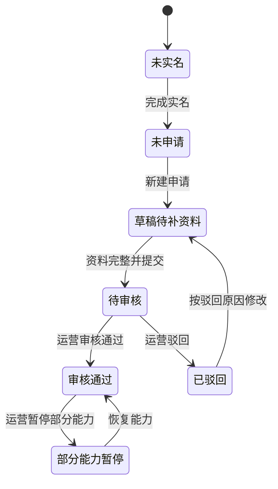
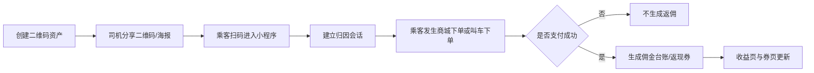
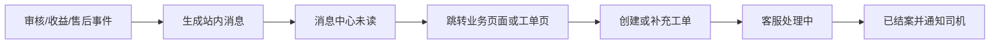

# 司机轻端设计

**项目名称：** 千乘坊（ride-loop）  
**文档状态：** 草稿  
**负责人：** AI 软件工厂  
**主要读者：** 产品 | 设计 | 小程序前端 | 后端 | 测试  
**上游输入：** 端形态与渠道策略 | PRD | 接口与契约设计  
**下游输出：** 小程序页面原型 | 页面分包设计 | 联调用例  
**关联 ID：** `REQ-002`, `REQ-003`, `REQ-006`, `REQ-011`, `REQ-012`, `REQ-013`, `REQ-014`, `UI-DRV-L-001` - `UI-DRV-L-014`, `API-001`, `API-002`, `API-005`, `API-007`, `API-016`, `API-018`, `API-021` - `API-029`, `API-062` - `API-066`  
**最后更新：** 2026-03-29  

## 1. 端目标

- 承接司机的“分销商 + 平台消费者 + 资料维护”三类轻量能力。
- 让司机在碎片时间完成拉新、看收益、站内复购和发起申诉。
- 不承接实时接单主流程，不承担持续在线、稳定后台定位和派单强提醒职责。

## 2. 适用边界

- 适合放在司机轻端的能力：
  - 司机入驻与资料提交
  - 商品二维码分销
  - 归因订单查询
  - 佣金、余额、券查询
  - 司机专区下单与复购
  - 售后、收益申诉、消息查看
- 不放在司机轻端的能力：
  - 持续在线接单
  - 高可靠定位心跳
  - 派单弹层抢单
  - 行程中的连续状态推进

## 3. 信息架构

- 首页工作台
- 分销中心
- 收益中心
- 司机专区
- 消息中心
- 我的与司机资料
- 客服与申诉

## 4. 页面清单

| 页面 ID | 页面名称 | 路由建议 | 可见角色状态 | 页面目标 | 优先级 |
|---|---|---|---|---|---|
| `UI-DRV-L-001` | 登录与身份切换页 | `/pages/auth/login` | 全量用户 | 完成微信登录、角色切换、进入司机视角 | P0 |
| `UI-DRV-L-002` | 司机工作台首页 | `/pages/driver/home` | 已登录司机视角 | 聚合分销、收益、专区、消息入口 | P0 |
| `UI-DRV-L-003` | 入驻申请页 | `/pages/driver/access/apply` | 未通过司机能力校验 | 提交司机资料、车辆资料、结算资料 | P0 |
| `UI-DRV-L-004` | 审核状态页 | `/pages/driver/access/status` | 已提交申请 | 查看审核状态、驳回原因、补件入口 | P0 |
| `UI-DRV-L-005` | 分销中心页 | `/pages/driver/distribution/home` | 已通过司机能力校验 | 查看分销汇总、推广数据、生成物料 | P0 |
| `UI-DRV-L-006` | 二维码资产页 | `/pages/driver/distribution/qrcodes` | 已通过司机能力校验 | 管理商品码、专区码、活动码 | P0 |
| `UI-DRV-L-007` | 归因订单页 | `/pages/driver/distribution/orders` | 已通过司机能力校验 | 查看扫码后带来的商城/出行转化 | P0 |
| `UI-DRV-L-008` | 收益总览页 | `/pages/driver/finance/summary` | 已通过司机能力校验 | 查看待入账收益、可用余额、即将过期券 | P0 |
| `UI-DRV-L-009` | 台账明细页 | `/pages/driver/finance/ledger` | 已通过司机能力校验 | 查看佣金入账、冲销、专区消费、退款逆分录 | P0 |
| `UI-DRV-L-010` | 券与权益页 | `/pages/driver/finance/coupons` | 已通过司机能力校验 | 查看返现券、门槛、有效期、可用场景 | P0 |
| `UI-DRV-L-011` | 司机专区首页 | `/pages/driver-zone/home` | 已通过司机能力校验 | 浏览早餐、充电、洗车等专区商品 | P0 |
| `UI-DRV-L-012` | 司机专区下单页 | `/pages/driver-zone/checkout` | 已通过司机能力校验 | 选择券、余额和下单信息完成购买 | P0 |
| `UI-DRV-L-013` | 消息中心页 | `/pages/driver/messages` | 已登录司机视角 | 查看审核、收益、活动、工单消息 | P1 |
| `UI-DRV-L-014` | 客服与申诉页 | `/pages/driver/support` | 已登录司机视角 | 创建工单、查看处理进度、提交补充说明 | P1 |

## 5. 页面职责分解

| 页面 ID | 核心模块 | 主操作 | 前置条件 | 空态/异常态 |
|---|---|---|---|---|
| `UI-DRV-L-001` | 微信授权、协议确认、身份切换 | 登录、切换到司机视角 | 微信授权可用 | 登录失败提示重试；未实名时只显示实名引导 |
| `UI-DRV-L-002` | 收益卡片、分销卡片、司机专区卡片、待办消息 | 进入分销中心、进入收益页、进入专区、查看待办 | 已登录；读取司机能力状态 | 审核未通过时展示“立即入驻”；能力暂停时入口置灰并说明原因 |
| `UI-DRV-L-003` | 基础资料、驾驶证/从业证、车辆信息、银行卡信息、上传组件 | 保存草稿、提交审核、继续补件 | 已登录司机视角 | OCR 或上传失败；资料缺失时仅允许保存草稿 |
| `UI-DRV-L-004` | 审核时间线、驳回原因、补件入口 | 查看驳回详情、重新提交 | 存在申请记录 | 无申请记录时跳转申请页 |
| `UI-DRV-L-005` | 今日扫码、累计成交、活动入口、推广素材入口 | 去生成二维码、查看归因订单、复制文案 | 司机能力为已通过 | 无二维码时引导去创建；无成交时显示引导话术 |
| `UI-DRV-L-006` | 二维码列表、筛选、海报卡片、分享弹层 | 创建二维码、查看详情、保存海报、分享微信好友/群 | 司机能力为已通过 | 创建频率超限；模板失效时提示更新 |
| `UI-DRV-L-007` | 订单筛选、订单列表、归因明细、收益状态标签 | 按业务线筛选、按状态筛选、查看订单明细 | 司机能力为已通过 | 无归因订单时显示拉新引导；数据延迟时展示同步说明 |
| `UI-DRV-L-008` | 待入账、可用余额、券价值、冻结/逆冲提示 | 查看台账、查看券、进入司机专区 | 司机能力为已通过 | 余额为 0 时引导去分销或专区活动 |
| `UI-DRV-L-009` | 台账筛选、分录列表、分录详情抽屉 | 按类型过滤、按日期过滤、查看来源订单 | 司机能力为已通过 | 暂无分录时解释“支付完成后才返佣” |
| `UI-DRV-L-010` | 券列表、失效提醒、使用规则说明 | 查看券详情、查看可用商品、跳转专区下单 | 司机能力为已通过 | 无券时引导参与活动；临期券高亮提醒 |
| `UI-DRV-L-011` | 分类导航、商品卡片、权益 banner、最近订单 | 查看商品详情、切换分类、进入结算页 | 司机能力为已通过 | 分类无商品时显示替代推荐 |
| `UI-DRV-L-012` | 地址/提货信息、券选择、余额抵扣、确认订单 | 提交订单、选择券、切换余额抵扣 | 司机能力为已通过；商品可售 | 库存不足、券失效、余额不足时阻断提交 |
| `UI-DRV-L-013` | 消息分类、未读标记、跳转链接 | 查看详情、已读、跳转对应业务页面 | 已登录司机视角 | 无消息时展示订阅说明 |
| `UI-DRV-L-014` | 工单创建表单、我的工单列表、工单详情 | 新建工单、补充材料、查看处理结果 | 已登录司机视角 | 无关联业务对象时限制提交；上传附件失败时重试 |

## 6. 状态流转

### 6.1 司机能力状态定义

| 状态码 | 状态名称 | 页面表现 | 可执行动作 |
|---|---|---|---|
| `DRV-L-S01` | 未实名 | 只允许登录和实名引导 | 去实名 |
| `DRV-L-S02` | 未申请入驻 | 首页展示入驻引导 | 填写申请 |
| `DRV-L-S03` | 草稿待补资料 | 工作台展示补件待办 | 保存草稿、继续补资料 |
| `DRV-L-S04` | 待审核 | 分销、收益、专区入口锁定 | 查看状态、补充材料 |
| `DRV-L-S05` | 审核通过 | 所有轻端功能可用 | 分销、查看收益、专区下单、提交工单 |
| `DRV-L-S06` | 部分能力暂停 | 被暂停模块置灰并说明原因 | 查看原因、联系客服 |
| `DRV-L-S07` | 已驳回 | 工作台展示驳回提示 | 修改资料并重提 |

### 6.2 入驻与审核流

| 触发动作 | 来源状态 | 目标状态 | 前置校验 | 失败处理 |
|---|---|---|---|---|
| 保存草稿 | 未申请/已驳回 | 草稿待补资料 | 基础信息合法 | 保留草稿并提示缺失字段 |
| 提交审核 | 草稿待补资料 | 待审核 | 证件、车辆、结算信息齐全 | 返回字段级错误 |
| 审核通过 | 待审核 | 审核通过 | 后台审核动作成功 | 保持待审核并记录失败原因 |
| 审核驳回 | 待审核 | 已驳回 | 驳回原因必填 | 驳回动作不可提交空原因 |

### 6.3 分销归因与返佣流

| 业务节点 | 状态 | 司机侧可见性 | 说明 |
|---|---|---|---|
| 二维码创建 | 已生效/已停用/已过期 | `UI-DRV-L-006` | 仅已生效二维码允许分享 |
| 归因会话 | 生效中/已失效 | `UI-DRV-L-007` | 失效后新订单不再归因 |
| 归因订单 | 待支付/已支付/已退款 | `UI-DRV-L-007` | 只有已支付才会驱动返佣 |
| 佣金分录 | 待入账/已入账/已冲销 | `UI-DRV-L-008/009` | 退款会产生逆向分录 |
| 返现券 | 未生效/可使用/已使用/已过期 | `UI-DRV-L-010` | 过期券只保留记录，不可再核销 |

### 6.4 司机专区消费流

| 触发动作 | 来源状态 | 目标状态 | 约束 |
|---|---|---|---|
| 选择券 | 结算中 | 结算中 | 只能选择适用商品与未过期券 |
| 扣减余额 | 结算中 | 待创建订单 | 余额不足时阻断提交 |
| 提交订单 | 待创建订单 | 已创建 | 下单接口必须幂等 |
| 订单退款 | 已创建/已完成 | 退款中/已退款 | 由后台处理，轻端只读展示 |

### 6.5 消息与工单流

## 7. 接口清单

### 7.1 接口明细

| 接口 ID | 方法 | 路径 | 页面/流程 | 请求核心字段 | 响应核心字段 | 权限与约束 |
|---|---|---|---|---|---|---|
| `API-001` | `POST` | `/api/v1/auth/session` | `UI-DRV-L-001` | `wechatCode`, `clientType=driver-miniapp` | `sessionToken`, `userId`, `roles` | 登录成功后再调用司机能力相关接口 |
| `API-005` | `GET` | `/api/v1/me/profile` | `UI-DRV-L-001/002` | `sessionToken` | `userId`, `roles`, `driverCapabilityStatus` | 登录后调用，决定是否展示司机入口 |
| `API-016` | `POST` | `/api/v1/driver/access/applications` | `UI-DRV-L-003` | `baseInfo`, `licenses`, `vehicleInfo`, `settlementInfo`, `submit` | `applicationId`, `status`, `missingFields` | 保存草稿与提交审核共用，提交时必须校验完整性 |
| `API-021` | `GET` | `/api/v1/driver/dashboard` | `UI-DRV-L-002` | `cityCode` | `capabilityStatus`, `incomeSummary`, `distributionSummary`, `driverZoneSummary`, `todoList` | 聚合接口，轻端首页不拆多请求 |
| `API-022` | `GET` | `/api/v1/driver/distribution/qrcodes` | `UI-DRV-L-006` | `scene`, `status`, `pageNo`, `pageSize` | `items[]`, `total`, `templateVersion` | 仅已通过司机可见 |
| `API-023` | `POST` | `/api/v1/driver/distribution/qrcodes` | `UI-DRV-L-006` | `scene`, `productId`, `campaignId`, `posterTemplateId` | `qrCodeId`, `shortLink`, `posterUrl`, `status` | 创建动作必须幂等并记录模板版本 |
| `API-024` | `GET` | `/api/v1/driver/distribution/orders` | `UI-DRV-L-007` | `businessType`, `payStatus`, `dateRange`, `pageNo`, `pageSize` | `items[]`, `summary`, `attributionWindow` | 返回商城单和出行单的归因视图 |
| `API-025` | `GET` | `/api/v1/driver/finance/summary` | `UI-DRV-L-008` | `cityCode` | `pendingIncome`, `availableBalance`, `couponValue`, `negativeBalanceFlag` | 返回是否存在负余额提示 |
| `API-026` | `GET` | `/api/v1/driver/finance/ledger` | `UI-DRV-L-009` | `ledgerType`, `dateRange`, `pageNo`, `pageSize` | `items[]`, `total`, `nextCursor` | 金额只读，不允许前端计算汇总值 |
| `API-027` | `GET` | `/api/v1/driver/finance/coupons` | `UI-DRV-L-010` | `couponStatus`, `scene`, `pageNo`, `pageSize` | `items[]`, `expiringSoonCount` | 默认按可使用优先排序 |
| `API-028` | `GET` | `/api/v1/driver/access/application` | `UI-DRV-L-003/004` | 无 | `applicationId`, `status`, `rejectReasons`, `submittedAt`, `reviewTimeline[]` | 无申请记录时返回空态，不视为错误 |
| `API-029` | `GET` | `/api/v1/messages` | `UI-DRV-L-013` | `receiverRole=driver`, `messageType`, `pageNo`, `pageSize` | `items[]`, `unreadCount` | 消息点击后由客户端上报已读 |
| `API-002` | `GET` | `/api/v1/mall/products` | `UI-DRV-L-011` | `scene=driver-zone`, `categoryId`, `keyword` | `items[]`, `categoryTabs[]` | 司机专区复用商城商品体系 |
| `API-066` | `GET` | `/api/v1/mall/products/{productId}` | `UI-DRV-L-011/012` | `productId`, `scene=driver-zone` | `product`, `price`, `couponEligibility`, `stockStatus` | 结算前必须再次查询商品可售状态 |
| `API-007` | `POST` | `/api/v1/mall/orders` | `UI-DRV-L-012` | `scene`, `items[]`, `couponIds[]`, `walletAmount`, `deliveryInfo` | `orderId`, `orderStatus`, `deductionSummary` | 必带 `X-Idempotency-Key` |
| `API-062` | `GET` | `/api/v1/mall/orders` | `UI-DRV-L-011/014` | `scene=driver-zone`, `orderStatus`, `pageNo`, `pageSize` | `items[]`, `total` | 展示司机专区历史订单 |
| `API-063` | `GET` | `/api/v1/mall/orders/{orderId}` | `UI-DRV-L-014` | `orderId` | `order`, `refundInfo`, `ledgerRefs[]` | 用于工单提交时绑定业务对象 |
| `API-018` | `POST` | `/api/v1/support/tickets` | `UI-DRV-L-014` | `bizType`, `bizId`, `ticketType`, `description`, `attachments[]` | `ticketId`, `status` | 工单必须绑定订单或台账对象之一 |
| `API-064` | `GET` | `/api/v1/support/tickets` | `UI-DRV-L-014` | `initiatorRole=driver`, `ticketStatus`, `pageNo`, `pageSize` | `items[]`, `total` | 返回我的工单列表 |
| `API-065` | `GET` | `/api/v1/support/tickets/{ticketId}` | `UI-DRV-L-014` | `ticketId` | `ticket`, `timeline[]`, `attachments[]` | 只允许查看本人创建工单 |

### 7.2 页面与接口映射

| 页面 ID | 读接口 | 写接口 | 刷新策略 |
|---|---|---|---|
| `UI-DRV-L-001` | `API-005` | `API-001` | 登录成功后立即拉取身份与能力 |
| `UI-DRV-L-002` | `API-021` | 无 | 进入页面拉取，用户下拉刷新 |
| `UI-DRV-L-003` | `API-028` | `API-016` | 进入页面加载草稿，提交后回跳状态页 |
| `UI-DRV-L-004` | `API-028` | `API-016` | 进入页面拉取，驳回后支持重提 |
| `UI-DRV-L-005` | `API-021` | 无 | 与首页数据共享缓存 30 秒 |
| `UI-DRV-L-006` | `API-022` | `API-023` | 创建成功后列表局部刷新 |
| `UI-DRV-L-007` | `API-024` | 无 | 切换筛选项即时刷新 |
| `UI-DRV-L-008` | `API-025` | 无 | 进入页面拉取，支付回调后消息驱动刷新 |
| `UI-DRV-L-009` | `API-026` | 无 | 分页加载 |
| `UI-DRV-L-010` | `API-027` | 无 | 进入页面拉取，返回结算页时局部刷新 |
| `UI-DRV-L-011` | `API-002`, `API-062` | 无 | 类目切换刷新商品列表 |
| `UI-DRV-L-012` | `API-066` | `API-007` | 每次进入结算页强制重查商品与券可用性 |
| `UI-DRV-L-013` | `API-029` | 无 | 进入页面拉取，Tab 红点按未读数更新 |
| `UI-DRV-L-014` | `API-062`, `API-063`, `API-064`, `API-065` | `API-018` | 创建工单后回到详情页轮询处理结果 |

## 8. 前端规则与设计约束

- 首页、收益页、分销页的关键摘要必须取聚合结果，不允许前端自行汇总台账。
- 所有返佣展示都必须标注“支付成功后入账”，避免司机误以为下单即返。
- 司机专区只允许站内余额和返现券抵扣，不提供微信提现或银行卡提现入口。
- 被暂停能力的司机仍可查看历史数据，但对应入口必须置灰并展示停用原因。
- 小程序端不展示“上线接单”“保持在线”“后台定位正常”之类履约态提示，避免形成错误心智。

## 9. 已确认事项与剩余未决项

- 二维码海报首版是否只提供固定模板，暂不开放司机自定义文案。
- 已确认司机专区支持到店核销、到店自提、配送三种履约模式并存，但单个商品只允许配置一种履约模式。
- 消息中心的未读红点是全局一个红点，还是按“审核/收益/工单”三类分组显示。

## 10. 变更记录

| 日期 | 变更内容 | 变更人 |
|---|---|---|
| 2026-03-29 | 初始版本 | AI 软件工厂 |
| 2026-03-29 | 补充逐页职责、状态定义、共享接口与页面映射 | AI 软件工厂 |
