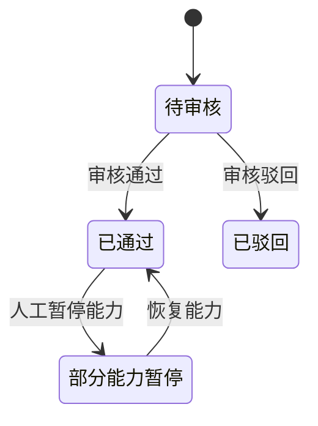
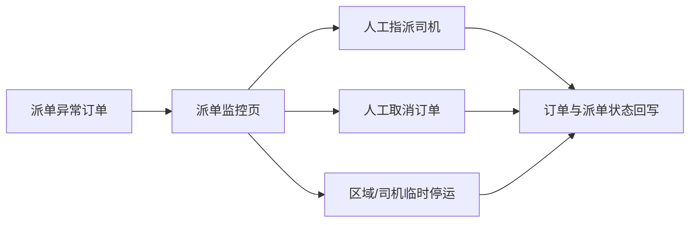
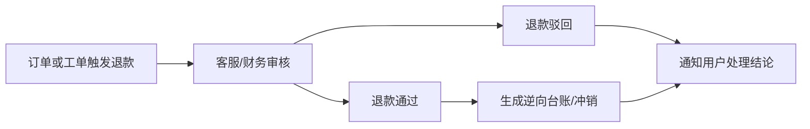

# 运营 Web 设计

**项目名称：** 千乘坊（ride-loop）  
**文档状态：** 草稿  
**负责人：** AI 软件工厂  
**主要读者：** 产品 | 设计 | Web 前端 | 后端 | 运营 | 财务 | 风控  
**上游输入：** 角色与业务模块需求分解 | PRD | 接口与契约设计  
**下游输出：** 后台原型 | RBAC 配置草案 | 联调清单  
**关联 ID：** `REQ-002`, `REQ-003`, `REQ-010`, `REQ-014`, `REQ-015`, `REQ-016`, `REQ-017`, `UI-OPS-001` - `UI-OPS-018`, `API-001`, `API-039` - `API-061`  
**最后更新：** 2026-03-29  

## 1. 端目标

- 为城市运营、调度运营、客服、财务、风控和管理员提供统一后台。
- 第一版优先满足“查得到、配得动、能干预、可追责”，不追求复杂 BI 和自动流程编排。
- 所有关键操作必须留审计痕迹，形成后续风控和对账基础。

## 2. 角色与权限视图

| 角色 | 核心职责 | 默认可见模块 | 禁止操作 |
|---|---|---|---|
| 城市运营 | 司机准入、商品与活动配置、经营跟进 | 司机管理、商品管理、归因规则、佣金规则、经营看板 | 不可直接改资金台账 |
| 调度运营 | 派单监控、异常人工介入、区域停运 | 出行订单、派单监控、干预页 | 不可改佣金规则与 RBAC |
| 客服 | 工单处理、订单售后、申诉转办 | 商城订单、出行订单、工单中心、退款查询 | 不可修改审核结果与风控结论 |
| 财务 | 台账查询、退款审核、对账异常处理 | 台账与余额、退款与售后、佣金规则 | 不可改派单和司机状态 |
| 风控 | 风险事件调查、审计日志复核、异常司机判定 | 司机档案、风控事件、审计日志 | 不可直接发布商品和活动 |
| 管理员 | 用户、角色、权限和基础配置维护 | 全模块 | 不应直接经办业务单据处理 |

## 3. 信息架构

- 首页总览
- 司机管理
- 商品与活动
- 出行与调度
- 订单与资金
- 客服工单
- 风控审计
- 数据看板
- 系统设置

## 4. 页面清单

| 页面 ID | 页面名称 | 路由建议 | 主要角色 | 页面目标 | 优先级 |
|---|---|---|---|---|---|
| `UI-OPS-001` | 登录页 | `/admin/login` | 全角色 | 完成后台鉴权与角色进入 | P0 |
| `UI-OPS-002` | 首页总览 | `/admin/dashboard` | 全角色 | 查看核心经营指标和异常指标 | P0 |
| `UI-OPS-003` | 司机审核列表 | `/admin/drivers/reviews` | 城市运营 | 批量审核司机入驻申请 | P0 |
| `UI-OPS-004` | 司机档案详情 | `/admin/drivers/{id}` | 城市运营/风控 | 查看司机能力、证件、历史风险 | P0 |
| `UI-OPS-005` | 商品管理页 | `/admin/mall/products` | 城市运营 | 配置商城与司机专区商品 | P0 |
| `UI-OPS-006` | 归因与活动规则页 | `/admin/distribution/rules` | 城市运营 | 配置二维码归因窗口和活动规则 | P0 |
| `UI-OPS-007` | 佣金规则页 | `/admin/finance/commission-rules` | 城市运营/财务 | 配置返佣、返现券和冲销策略 | P0 |
| `UI-OPS-008` | 商城订单页 | `/admin/orders/mall` | 运营/客服 | 查询商城订单和售后状态 | P0 |
| `UI-OPS-009` | 出行订单页 | `/admin/orders/ride` | 调度运营/客服 | 查询出行订单和轨迹状态 | P0 |
| `UI-OPS-010` | 派单监控页 | `/admin/dispatch/monitor` | 调度运营 | 查看在线司机、派单失败和重派情况 | P0 |
| `UI-OPS-011` | 派单干预页 | `/admin/dispatch/interventions/{id}` | 调度运营 | 人工指派、取消、停运或恢复 | P1 |
| `UI-OPS-012` | 台账与余额页 | `/admin/finance/ledger` | 财务 | 查询佣金台账、站内余额和冲销记录 | P0 |
| `UI-OPS-013` | 退款与售后页 | `/admin/finance/refunds` | 财务/客服 | 处理退款、售后核查和对账异常 | P1 |
| `UI-OPS-014` | 工单中心 | `/admin/support/tickets` | 客服 | 处理乘客与司机工单、转办和结案 | P0 |
| `UI-OPS-015` | 风控事件页 | `/admin/risk/events` | 风控 | 识别异常订单、异常司机和线索 | P1 |
| `UI-OPS-016` | 审计日志页 | `/admin/audit/logs` | 风控/管理员 | 查询关键操作日志和责任链 | P1 |
| `UI-OPS-017` | 经营看板页 | `/admin/analytics/business` | 运营/管理者 | 查看拉新、出行、返佣、复购指标 | P1 |
| `UI-OPS-018` | 系统与权限页 | `/admin/settings/rbac` | 管理员 | 维护角色、权限和基础配置 | P1 |

## 5. 页面职责分解

| 页面 ID | 核心模块 | 主操作 | 前置条件 | 空态/异常态 |
|---|---|---|---|---|
| `UI-OPS-001` | 登录表单、验证码、角色选择 | 登录、切换角色入口 | 后台账号有效 | 无权限角色阻止进入后台 |
| `UI-OPS-002` | KPI 卡片、异常卡片、待办列表 | 查看指标、跳转异常列表 | 已登录后台 | 指标延迟时展示数据时间戳 |
| `UI-OPS-003` | 申请列表、筛选、批量审核 | 查看申请、通过、驳回、暂停能力 | 具备司机审核权限 | 无申请时展示空态，不展示错误 |
| `UI-OPS-004` | 档案详情、证件信息、能力状态、风险标签 | 查看详情、调整能力、查看历史 | 从审核列表或搜索进入 | 司机不存在时给出标准错误页 |
| `UI-OPS-005` | 商品列表、商品编辑、上下架、专区标签 | 创建商品、编辑商品、上下架、切换专区分类 | 具备商品运营权限 | 草稿商品保存失败时不影响已发布商品 |
| `UI-OPS-006` | 归因窗口、渠道规则、活动规则、预览 | 修改规则、发布规则、下线规则 | 具备活动配置权限 | 生效中规则冲突时阻止保存 |
| `UI-OPS-007` | 佣金比例、券模板、负余额策略 | 新建规则、修改规则、启停规则 | 具备财务或运营配置权限 | 生效区间冲突时阻止发布 |
| `UI-OPS-008` | 订单筛选、售后状态、退款进度 | 查订单、查看详情、进入退款/工单 | 具备订单查看权限 | 订单量大时必须分页与异步导出 |
| `UI-OPS-009` | 行程列表、轨迹摘要、派单结果 | 查行程、看轨迹、跳派单干预 | 具备出行订单权限 | 敏感字段按角色脱敏 |
| `UI-OPS-010` | 实时在线司机、派单中订单、失败原因、热区图 | 查看监控、进入人工干预 | 具备调度运营权限 | 调度服务降级时展示缓存时间和告警 |
| `UI-OPS-011` | 干预表单、目标司机、操作原因 | 人工指派、取消订单、区域停运、恢复 | 来自派单监控页或订单页 | 无可干预空间时仅允许查看历史 |
| `UI-OPS-012` | 台账列表、余额视图、逆分录、来源跳转 | 查台账、看来源、识别负余额 | 具备财务权限 | 金额字段默认按权限展示精度 |
| `UI-OPS-013` | 退款列表、退款详情、对账异常面板 | 审核退款、驳回退款、标记异常已处理 | 具备退款处理权限 | 已完成退款不可重复处理 |
| `UI-OPS-014` | 工单列表、详情、转办、结案、备注 | 受理工单、转财务、转风控、结案 | 具备客服权限 | 工单已结案时禁止再次改结论 |
| `UI-OPS-015` | 风险事件、规则命中、风险档案 | 查看事件、标记风险等级、提交复核 | 具备风控权限 | 无证据链时禁止输出高风险结论 |
| `UI-OPS-016` | 操作日志、筛选器、详情抽屉 | 查日志、追溯操作链 | 具备审计权限 | 日志只读，不允许修改 |
| `UI-OPS-017` | 趋势图、漏斗图、城市指标、对比分析 | 看趋势、导出视图、切换时间范围 | 具备看板权限 | 数据计算失败时保留上次成功快照 |
| `UI-OPS-018` | 角色列表、权限矩阵、用户绑定 | 创建角色、分配权限、配置基础参数 | 具备管理员权限 | 高危权限变更需二次确认 |

## 6. 核心工作流与状态流转

### 6.1 司机审核流

| 触发动作 | 来源状态 | 目标状态 | 必填字段 | 审计要求 |
|---|---|---|---|---|
| 审核通过 | 待审核 | 已通过 | 审核人、审核备注 | 写入操作人、时间、能力包 |
| 审核驳回 | 待审核 | 已驳回 | 驳回原因 | 原因可回显给司机 |
| 暂停能力 | 已通过 | 部分能力暂停 | 暂停模块、原因、结束时间 | 必须记录影响模块 |
| 恢复能力 | 部分能力暂停 | 已通过 | 恢复原因 | 必须保留前后状态 |

### 6.2 派单异常人工干预流

| 干预类型 | 入口页面 | 目标对象 | 必填字段 | 结果回写 |
|---|---|---|---|---|
| 人工指派 | `UI-OPS-011` | 订单、目标司机 | 目标司机、原因 | 回写订单状态和派单轨迹 |
| 人工取消 | `UI-OPS-011` | 订单 | 取消原因、责任方 | 回写订单状态并通知乘客/司机 |
| 区域停运 | `UI-OPS-011` | 区域或司机 | 生效时间、失效时间、原因 | 回写在线可接单资格 |

### 6.3 退款与售后流

| 处理节点 | 页面 | 关键校验 | 输出 |
|---|---|---|---|
| 退款申请查看 | `UI-OPS-013` | 订单状态、支付状态、已退款金额 | 退款候选单 |
| 退款审核通过 | `UI-OPS-013` | 退款额度、责任归属、冲销影响 | 退款单、逆向台账 |
| 退款审核驳回 | `UI-OPS-013` | 驳回原因必填 | 驳回记录、通知任务 |
| 工单结案 | `UI-OPS-014` | 结论明确、责任主体明确 | 工单结论、通知任务 |

### 6.4 风控与审计流

| 风控动作 | 页面 | 必填字段 | 结果 |
|---|---|---|---|
| 标记风险等级 | `UI-OPS-015` | 等级、证据摘要 | 更新风险档案 |
| 提交复核 | `UI-OPS-015` | 复核原因 | 生成复核任务 |
| 查询审计链 | `UI-OPS-016` | 对象类型、对象 ID | 返回完整操作轨迹 |

## 7. 接口清单

### 7.1 接口明细

| 接口 ID | 方法 | 路径 | 页面/流程 | 请求核心字段 | 响应核心字段 | 权限与审计要求 |
|---|---|---|---|---|---|---|
| `API-001` | `POST` | `/api/v1/auth/session` | `UI-OPS-001` | `account`, `password` 或 `ssoTicket`, `clientType=ops-web` | `sessionToken`, `userId`, `roles` | 登录后按角色生成后台菜单与权限上下文 |
| `API-039` | `GET` | `/api/v1/admin/dashboard` | `UI-OPS-002` | `cityCode`, `date` | `kpis`, `alerts`, `todoList` | 聚合接口，按角色裁剪字段 |
| `API-040` | `GET` | `/api/v1/admin/drivers/reviews` | `UI-OPS-003` | `status`, `cityCode`, `pageNo`, `pageSize` | `items[]`, `total` | 只返回有审核权限城市的数据 |
| `API-041` | `POST` | `/api/v1/admin/drivers/{driverId}/review` | `UI-OPS-003/004` | `action=approve/reject/suspend/resume`, `reason`, `capabilities[]` | `driverStatus`, `effectiveCapabilities[]` | 必须记录操作人、原因和前后状态 |
| `API-042` | `GET` | `/api/v1/admin/distribution/rules` | `UI-OPS-006` | `ruleType`, `cityCode` | `rules[]`, `effectiveVersion` | 规则带版本号 |
| `API-043` | `POST` | `/api/v1/admin/distribution/rules` | `UI-OPS-006` | `ruleSet`, `publishAt`, `changeReason` | `version`, `status` | 保存和发布都要记审计日志 |
| `API-044` | `GET` | `/api/v1/admin/dispatch/monitor` | `UI-OPS-010` | `regionCode`, `timeWindow` | `onlineDrivers`, `dispatchingOrders`, `failedOrders`, `heatmap` | 调度降级时返回数据时间戳 |
| `API-045` | `POST` | `/api/v1/admin/dispatch/interventions` | `UI-OPS-011` | `orderId`, `interventionType`, `targetDriverId`, `reason` | `result`, `orderStatus`, `dispatchTrace` | 每次干预都必须写操作日志 |
| `API-046` | `GET` | `/api/v1/admin/finance/ledger` | `UI-OPS-012` | `ledgerType`, `driverId`, `dateRange`, `pageNo`, `pageSize` | `items[]`, `balanceSummary`, `negativeDrivers[]` | 金额字段受财务权限控制 |
| `API-047` | `GET` | `/api/v1/admin/support/tickets` | `UI-OPS-014` | `ticketStatus`, `bizType`, `assigneeId`, `pageNo`, `pageSize` | `items[]`, `total` | 客服、财务、风控共享工单上下文 |
| `API-048` | `POST` | `/api/v1/admin/support/tickets/{ticketId}/actions` | `UI-OPS-014` | `action=accept/transfer/resolve/reopen`, `reason`, `targetRole` | `ticketStatus`, `timeline[]` | 工单操作人和备注必留痕 |
| `API-049` | `GET` | `/api/v1/admin/risk/events` | `UI-OPS-015` | `riskLevel`, `eventType`, `pageNo`, `pageSize` | `items[]`, `evidenceSummary` | 仅风控角色可见高敏证据字段 |
| `API-050` | `GET` | `/api/v1/admin/analytics/business` | `UI-OPS-017` | `metricSet`, `dateRange`, `granularity` | `charts[]`, `summary`, `compareMetrics` | 看板按小时或日级聚合返回 |
| `API-051` | `GET` | `/api/v1/admin/mall/products` | `UI-OPS-005` | `scene`, `status`, `categoryId`, `pageNo`, `pageSize` | `items[]`, `categoryTree` | 支持商城与司机专区两个场景 |
| `API-052` | `POST` | `/api/v1/admin/mall/products` | `UI-OPS-005` | `productDraft`, `action=save/publish/offline` | `productId`, `status`, `publishedAt` | 商品变更必须记录版本与操作人 |
| `API-053` | `GET` | `/api/v1/admin/orders/mall` | `UI-OPS-008` | `orderStatus`, `refundStatus`, `keyword`, `pageNo`, `pageSize` | `items[]`, `total`, `amountSummary` | 大结果集支持异步导出 |
| `API-054` | `GET` | `/api/v1/admin/orders/ride` | `UI-OPS-009` | `orderStatus`, `dispatchStatus`, `keyword`, `pageNo`, `pageSize` | `items[]`, `total`, `dispatchSummary` | 敏感信息按角色脱敏 |
| `API-055` | `GET` | `/api/v1/admin/finance/commission-rules` | `UI-OPS-007` | `cityCode`, `businessType` | `rules[]`, `effectiveVersion` | 返回生效中与草稿版 |
| `API-056` | `POST` | `/api/v1/admin/finance/commission-rules` | `UI-OPS-007` | `ruleSet`, `publishAt`, `changeReason` | `version`, `status` | 财务规则修改必须带变更原因 |
| `API-057` | `GET` | `/api/v1/admin/finance/refunds` | `UI-OPS-013` | `refundStatus`, `bizType`, `pageNo`, `pageSize` | `items[]`, `total`, `pendingAmount` | 展示退款与对账异常统一视图 |
| `API-058` | `POST` | `/api/v1/admin/finance/refunds/{refundId}/actions` | `UI-OPS-013` | `action=approve/reject/manualAdjust`, `reason`, `amount` | `refundStatus`, `ledgerRefs[]` | 处理动作必须写逆向台账引用 |
| `API-059` | `GET` | `/api/v1/admin/audit/logs` | `UI-OPS-016` | `operatorId`, `actionType`, `bizObject`, `pageNo`, `pageSize` | `items[]`, `traceId` | 审计日志只读，不允许导出未脱敏原文给无权角色 |
| `API-060` | `GET` | `/api/v1/admin/settings/rbac` | `UI-OPS-018` | `roleId` | `roles[]`, `permissions[]`, `bindings[]` | 仅管理员可用 |
| `API-061` | `POST` | `/api/v1/admin/settings/rbac` | `UI-OPS-018` | `action=createRole/updateRole/bindUser/updatePermission`, `payload`, `reason` | `roleStatus`, `version` | 高危权限变更要求二次确认和审计 |

### 7.2 页面与接口映射

| 页面 ID | 读接口 | 写接口 | 说明 |
|---|---|---|---|
| `UI-OPS-001` | 无 | `API-001` | 后台统一登录入口 |
| `UI-OPS-002` | `API-039` | 无 | 主页仅展示聚合数据，不承接写操作 |
| `UI-OPS-003/004` | `API-040` | `API-041` | 审核列表与档案详情共享审核写口 |
| `UI-OPS-005` | `API-051` | `API-052` | 商品草稿、发布、下线共用一个写入口 |
| `UI-OPS-006` | `API-042` | `API-043` | 规则保存与发布都需要版本化 |
| `UI-OPS-007` | `API-055` | `API-056` | 佣金规则按城市和业务线隔离 |
| `UI-OPS-008` | `API-053` | 无 | 详情操作通过工单或退款流程承接 |
| `UI-OPS-009` | `API-054` | 无 | 详情跳转派单干预或工单中心 |
| `UI-OPS-010/011` | `API-044` | `API-045` | 监控页发现异常后进入干预页处理 |
| `UI-OPS-012` | `API-046` | 无 | 财务台账只读，调整走退款或规则变更流程 |
| `UI-OPS-013` | `API-057` | `API-058` | 退款处理必须回写台账引用 |
| `UI-OPS-014` | `API-047` | `API-048` | 工单处理统一在客服中心闭环 |
| `UI-OPS-015` | `API-049` | 无 | 风控结论首版先沉在事件流和审计里，不开放直接封禁接口 |
| `UI-OPS-016` | `API-059` | 无 | 审计日志只读 |
| `UI-OPS-017` | `API-050` | 无 | 看板支持条件切换和导出视图 |
| `UI-OPS-018` | `API-060` | `API-061` | 权限与角色配置单独由管理员维护 |

## 8. 后台设计约束

- 所有后台写操作都必须要求填写“操作原因”或“变更原因”。
- 后台页面默认按角色裁剪字段，不允许前端拿到全量字段后自行隐藏。
- 调度干预、退款处理、司机审核、权限变更属于高风险操作，必须支持二次确认。
- 商品规则、归因规则、佣金规则都需要版本化，避免直接覆盖生效配置。
- 审计日志必须能反查到“谁在什么时间对什么对象做了什么操作，前后值是什么”。

## 9. 已确认事项与剩余未决项

- 首版是否支持对账报表导出，还是只提供列表查询。
- 风控事件页是否需要首版就支持人工规则标注和样本回放。
- 已确认首版做到菜单级 + 页面动作级；审核、退款、调度干预、权限变更等高风险动作执行按钮必须单独控权。

## 10. 变更记录

| 日期 | 变更内容 | 变更人 |
|---|---|---|
| 2026-03-29 | 初始版本 | AI 软件工厂 |
| 2026-03-29 | 补充角色权限、核心工作流、后台缺失接口与审计约束 | AI 软件工厂 |
