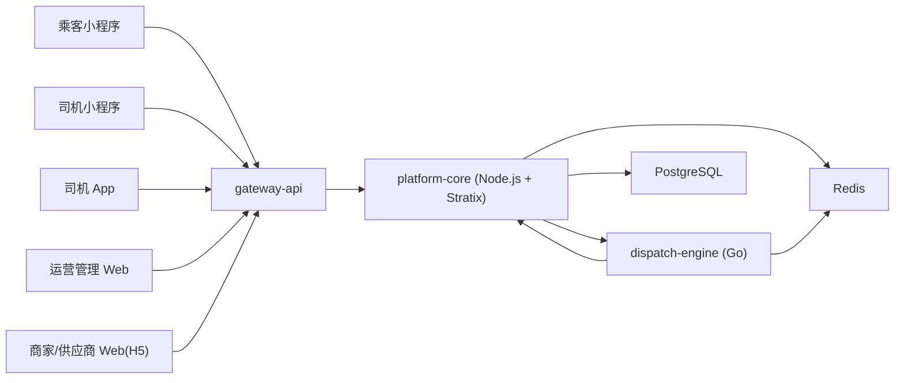

# 系统架构设计

**项目名称：** 千乘坊（ride-loop）  
**文档状态：** 草稿  
**负责人：** AI 软件工厂  
**主要读者：** 架构 | 开发 | 测试 | 运维  
**上游输入：** PRD | 需求分析 | 风险登记册  
**下游输出：** 模块边界 | 接口契约 | 实施计划 | 测试计划  
**关联 ID：** `REQ-001` - `REQ-017`, `NFR-001` - `NFR-004`, `ADR-001` - `ADR-004`, `MOD-001` - `MOD-012`  
**最后更新：** 2026-03-29  

## 1. 架构概览

- 系统目标：在武汉单城跑通“商城 + 出行”双主线 MVP，并保持司机返利只在平台内循环。
- 总体思路：外部流量统一经过接入层，主业务由 `platform-core` 统一持有订单和台账真相，调度由 `dispatch-engine` 独立承担高实时匹配。
- 架构风格：单仓多服务、同步 HTTP 为主、主库集中事实、Redis 保存高频短态。

## 2. 设计驱动因素

| 类型 | 条目 | 影响 |
|---|---|---|
| 功能需求 | `REQ-001` 统一司机账户 | 需要统一身份域和角色开关 |
| 功能需求 | `REQ-004` 支付后返佣 | 需要账务台账模型与支付回调幂等 |
| 功能需求 | `REQ-007` 派单调度独立 | 需要把订单真相与派单短态解耦 |
| 非功能需求 | `NFR-001` 性能 | 接入层和调度服务必须轻量同步 |
| 非功能需求 | `NFR-003` 可用性 | 调度服务失败不能破坏主订单事实 |
| 风险 | `RISK-002` 版本差异 | 需要把框架依赖与业务设计解耦 |
| 风险 | `RISK-004` 退款冲抵 | 需要以台账而非余额快照建模 |

## 3. 逻辑分层与关键组件

| 组件/模块 | 职责 | 输入 | 输出 | 依赖 |
|---|---|---|---|---|
| `MOD-001 gateway-api` | 鉴权、会话、接口聚合、幂等入口 | 小程序/后台请求 | 统一 API 响应 | `platform-core` |
| `MOD-002 identity-driver` | 用户、司机档案、角色和权限 | 登录、身份资料、权限查询 | 统一账户与角色视图 | PostgreSQL |
| `MOD-003 commerce` | 商品、二维码归因、商城订单 | 商品请求、二维码、支付结果 | 商城订单与归因事实 | PostgreSQL |
| `MOD-004 ride-order` | 叫车、行程订单、行程状态 | 叫车请求、派单反馈、支付回调 | 行程订单与状态机 | PostgreSQL, `dispatch-engine` |
| `MOD-005 finance` | 佣金、钱包、返现券、退款冲抵 | 支付成功、退款成功、专区消费 | 佣金台账、钱包台账、券记录 | PostgreSQL |
| `MOD-006 dispatch-engine` | 司机在线态、派单匹配、超时重派 | 派单请求、司机状态上报 | 候选司机、派单结果、重派事件 | Redis, `platform-core` |
| `MOD-007 ops-admin` | 运营配置和审计查询 | 后台配置、筛选条件 | 规则、查询结果、运营视图 | `platform-core` |
| `MOD-008 driver-access` | 司机入驻、审核、能力启停、设备绑定 | 司机资料、后台审核、设备绑定 | 司机能力状态、审核记录 | PostgreSQL |
| `MOD-009 message-center` | 站内消息、微信通知、App 推送 | 订单事件、收益事件、派单事件 | 通知任务、消息记录 | PostgreSQL, 第三方消息服务 |
| `MOD-010 support-service` | 客服工单、售后、申诉 | 订单、台账、投诉和申诉请求 | 工单状态、处理结果 | PostgreSQL |
| `MOD-011 risk-compliance` | 风控、审计、异常检测 | 订单、台账、调度和审核事件 | 风险线索、审计记录 | PostgreSQL |
| `MOD-012 analytics-insights` | 经营看板与运营分析 | 订单、司机、台账、活动数据 | 看板与指标聚合 | PostgreSQL |

## 4. 关键数据流与时序

### 场景 1：商城闭环

1. 司机生成或分享带归因参数的二维码。
2. 乘客扫码进入小程序，经 `gateway-api` 进入 `platform-core` 建立归因关系。
3. 乘客浏览商品、创建商城订单、完成支付。
4. 支付回调成功后，`finance` 子域生成佣金台账、站内余额或返现券。
5. 司机在司机专区消费，系统依据台账和券完成抵扣。

### 场景 2：出行闭环

1. 乘客在武汉单城发起叫车，`platform-core` 创建待派单行程订单。
2. `platform-core` 调用 `dispatch-engine`，后者读取司机在线态并返回候选司机。
3. 司机接单或超时，`dispatch-engine` 继续重派并把结果回传 `platform-core`。
4. 行程完成后乘客支付。
5. `finance` 子域基于履约司机和引流司机分别记账。

## 5. 数据设计摘要

- 关键实体：用户、司机档案、归因会话、商城订单、行程订单、派单批次、佣金台账、钱包账户、钱包分录、返现券、司机专区订单。
- 数据生命周期：
  - 归因会话有有效窗口。
  - 商城订单和行程订单是最终业务事实。
  - 派单短态可以驻留在 Redis，并定期回写必要的审计轨迹。
  - 钱包余额由台账聚合得出，不以单个数值为唯一事实。
- 一致性要求：
  - 支付回调、返佣入账、退款冲抵必须幂等。
  - 行程订单状态与派单状态同步时，主业务系统优先。
- 迁移策略：先按武汉单城设计城市维度字段，后续扩城只扩配置和数据范围，不改核心模型。

## 6. 部署与运行拓扑

- 环境：本地开发、测试环境、生产环境。
- 运行节点：
  - `gateway-api`
  - `platform-core`
  - `dispatch-engine`
  - `PostgreSQL`
  - `Redis`
- 外部依赖：支付服务、地图/定位服务、短信或消息服务。
- 高可用/扩展策略：
  - `dispatch-engine` 可横向扩容，状态主要依赖 Redis。
  - `platform-core` 通过无状态实例扩容，数据库和 Redis 作为共享基础设施。

## 7. 安全与可靠性设计

- 认证与授权：统一账户鉴权，司机与运营角色采用权限分层。
- 审计与日志：支付、返佣、退款、派单、审核、后台配置变更保留审计记录。
- 故障隔离：
  - 调度服务不可用时，主订单进入“派单失败待处理”状态。
  - 钱包台账写入失败时，不允许伪造成功支付后的返佣完成态。
- 降级与恢复：
  - 支付成功后的资金分录使用幂等键重试。
  - 调度失败可重试或进入人工干预流程。

## 8. 架构决策记录

| `ADR` | 决策 | 备选方案 | 结论 |
|---|---|---|---|
| `ADR-001` | 首版采用双核服务 + 共享平台库 | 单体 / 全面微服务 | 采用双核服务 |
| `ADR-002` | 司机采用统一账户模型 | 两套司机体系 | 采用统一账户 |
| `ADR-003` | 返现仅站内循环，不支持提现 | 可提现佣金 | 采用站内循环 |
| `ADR-004` | 单城市先从武汉运营 | 多城市并行 | 武汉单城先行 |

## 9. 未决问题

- 地图与定价服务的最终供应商尚未确认。
- 公开可安装的 Stratix 版本和设计目标版本之间需要一条补充 ADR。
- 司机重端的技术栈和发布方式仍需在进入实现前定稿。

## 10. 变更记录

| 日期 | 变更内容 | 变更人 |
|---|---|---|
| 2026-03-29 | 初始版本 | AI 软件工厂 |
