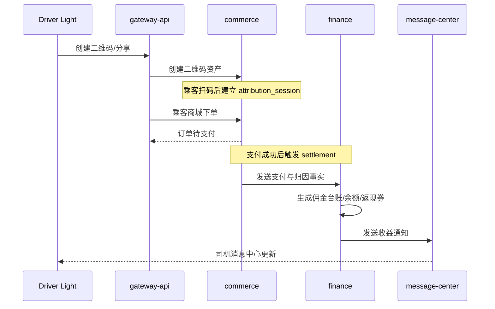
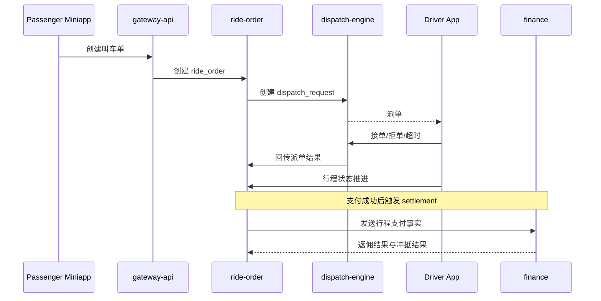
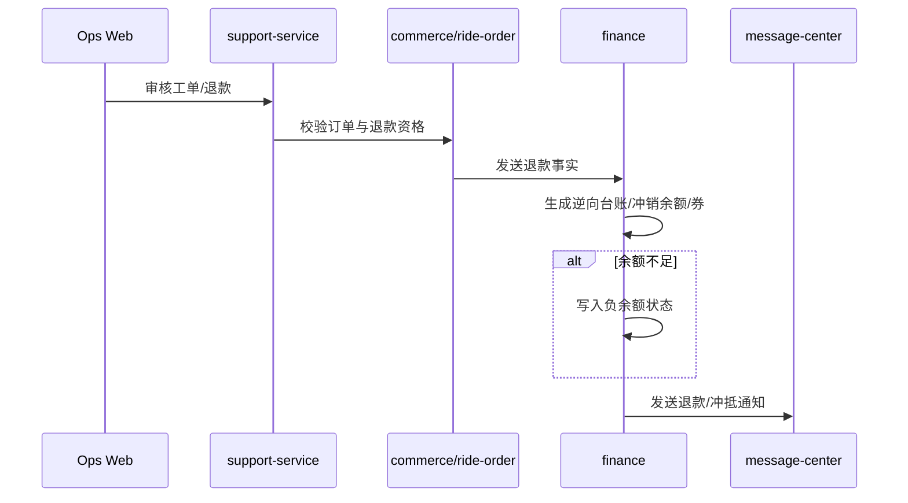
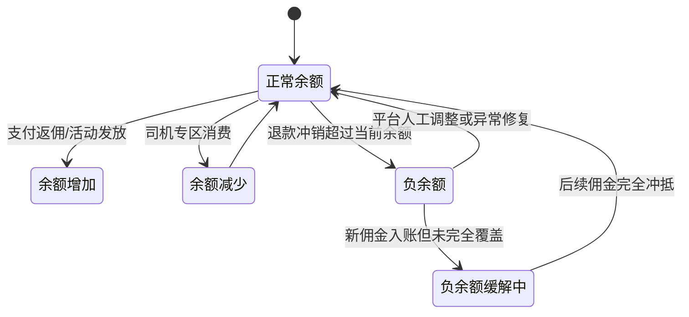

# 系统详细设计

**项目名称：** 千乘坊（ride-loop）  
**文档状态：** 草稿  
**负责人：** AI 软件工厂  
**主要读者：** 架构 | 后端 | 前端 | QA | 运维  
**上游输入：** 系统架构 | 模块边界 | 接口与契约设计 | 三端规格文档  
**下游输出：** 服务骨架任务拆分 | OpenAPI 契约 | 数据库设计 | 测试用例  
**关联 ID：** `MOD-001` - `MOD-012`, `REQ-001` - `REQ-017`, `API-001` - `API-066`  
**最后更新：** 2026-03-29  

## 1. 详细设计目标

- 把高层架构落到模块级职责、状态、接口调用和失败处理层。
- 让前端、后端、测试、运维对“哪个模块负责什么”形成统一理解。
- 在进入实现前，先把双主线业务闭环的编排关系写清楚。

## 2. 关键设计决策

| 决策 ID | 结论 | 影响模块 |
|---|---|---|
| `SYS-DEC-001` | 武汉单城先行，但所有城市相关实体都保留 `city_code` | `MOD-003`, `MOD-004`, `MOD-005`, `MOD-007`, `MOD-012` |
| `SYS-DEC-002` | 司机统一账户，同时具备接单、分销、司机专区消费三类能力 | `MOD-002`, `MOD-005`, `MOD-008` |
| `SYS-DEC-003` | 司机专区支持多履约模式并存，但单商品只允许一种履约模式 | `MOD-003`, `MOD-005`, `MOD-007` |
| `SYS-DEC-004` | 司机重端 Android 优先，唯一负责接单与行程推进 | `MOD-001`, `MOD-006`, `MOD-008` |
| `SYS-DEC-005` | 返现仅站内循环，不支持提现；退款允许形成负余额并由后续佣金优先冲抵 | `MOD-005`, `MOD-007`, `MOD-010`, `MOD-011` |
| `SYS-DEC-006` | 运营后台按菜单级 + 动作级权限设计，高风险操作必须审计 | `MOD-007`, `MOD-011` |

## 3. 核心业务时序

### 3.1 商城闭环时序

### 3.2 出行闭环时序

### 3.3 退款与负余额冲抵时序

## 4. 资金状态图

| 状态 | 司机端展示 | 后台展示 | 关键规则 |
|---|---|---|---|
| 正常余额 | 可用余额正常显示 | 台账与余额正常 | 可用于司机专区消费 |
| 负余额 | 明确显示“待后续收益冲抵” | 财务页高亮 | 不允许提现；允许继续查看但限制部分消费策略 |
| 负余额缓解中 | 显示“已冲抵部分金额” | 展示剩余缺口 | 新佣金优先冲抵，不先进入可用余额 |

## 5. 模块详细设计

### 5.1 `MOD-001 gateway-api`

| 项 | 设计 |
|---|---|
| 模块职责 | 统一鉴权、会话、限流、幂等入口、协议收敛、外部接口聚合 |
| 核心对象 | `SessionContext`, `RequestContext`, `IdempotencyRecord` |
| 关键命令 | 创建会话、校验 token、路由转发、注入 operator 上下文 |
| 关键查询 | 当前身份、客户端类型、幂等冲突状态 |
| 入站流量 | 乘客小程序、司机轻端、司机重端、运营 Web |
| 出站依赖 | `MOD-002`, `MOD-003`, `MOD-004`, `MOD-005`, `MOD-007`, `MOD-010` |
| 风险控制 | 高风险后台写请求必须带 `operatorId` 与 `reason` |
| 降级策略 | 上游不可用时返回标准错误结构，不拼接伪数据 |

### 5.2 `MOD-002 identity-driver`

| 项 | 设计 |
|---|---|
| 模块职责 | 管理统一账户、角色关系、司机主体档案与能力状态 |
| 核心聚合 | `UserAccount`, `UserRoleBinding`, `DriverProfile` |
| 关键命令 | 角色绑定、司机档案更新、能力状态查询 |
| 关键查询 | 根据 `userId` 查询当前角色、司机能力、城市归属 |
| 关键状态 | `inactive`, `active`, `suspended`, `rejected` |
| 入站依赖 | `MOD-001`, `MOD-003`, `MOD-004`, `MOD-005`, `MOD-007`, `MOD-008` |
| 出站依赖 | PostgreSQL `identity` schema |
| 关键规则 | 司机是统一账户下的扩展能力，不创建独立账号体系 |

### 5.3 `MOD-003 commerce`

| 项 | 设计 |
|---|---|
| 模块职责 | 商品、二维码、归因会话、商城订单、司机专区订单与履约模式管理 |
| 核心聚合 | `Product`, `Sku`, `QrCodeAsset`, `AttributionSession`, `MallOrder` |
| 关键命令 | 创建二维码、建立归因会话、创建商城订单、创建司机专区订单、发起退款校验 |
| 关键查询 | 商品列表、商品详情、商城订单、司机专区订单、归因订单 |
| 关键状态 | 商品：`draft/published/offline`; 订单：`pending_pay/paid/fulfilling/completed/refunding/refunded` |
| 入站依赖 | `MOD-001`, `MOD-007`, 支付回调 |
| 出站依赖 | `MOD-002`, `MOD-005`, `MOD-009`, `MOD-010` |
| 关键规则 | 单个商品只允许一种履约方式；支持 `in_store_verify`, `pickup`, `delivery` 三种模式 |
| 降级策略 | 支付未确认前只保留待支付订单，不触发返佣与券发放 |

### 5.4 `MOD-004 ride-order`

| 项 | 设计 |
|---|---|
| 模块职责 | 创建叫车订单、维护行程状态机、承接调度结果、存储轨迹与判责基础事实 |
| 核心聚合 | `RideOrder`, `RideTimeline`, `RidePricingSnapshot`, `DispatchRequestRef` |
| 关键命令 | 创建叫车单、取消订单、回写接单结果、推进行程状态、提交支付完成事实 |
| 关键查询 | 叫车单详情、订单状态、行程时间线、司机/乘客视图 |
| 关键状态 | `created`, `dispatching`, `accepted`, `arrived`, `in_trip`, `awaiting_payment`, `completed`, `cancelled`, `exception` |
| 入站依赖 | `MOD-001`, `MOD-006`, 支付回调 |
| 出站依赖 | `MOD-002`, `MOD-005`, `MOD-009`, `MOD-010`, `MOD-011` |
| 关键规则 | 订单真相只保存在本模块；调度服务不拥有订单最终状态 |
| 降级策略 | 调度不可用时订单进入 `dispatch_failed_pending_manual`，等待后台干预 |

### 5.5 `MOD-005 finance`

| 项 | 设计 |
|---|---|
| 模块职责 | 返佣、钱包、返现券、退款逆向台账、负余额冲抵 |
| 核心聚合 | `WalletAccount`, `WalletEntry`, `CommissionRule`, `CommissionLedger`, `CouponTemplate`, `CouponRecord` |
| 关键命令 | 生成佣金、钱包入账、券发放、券核销、退款冲销、负余额冲抵 |
| 关键查询 | 收益摘要、台账明细、可用券、负余额司机、冲销记录 |
| 关键状态 | 佣金：`pending/posted/reversed`; 券：`issued/active/used/expired/reversed`; 钱包：`normal/negative/recovering` |
| 入站依赖 | `MOD-003`, `MOD-004`, `MOD-007`, 支付/退款回调 |
| 出站依赖 | `MOD-009`, `MOD-010`, `MOD-011`, `MOD-012` |
| 关键规则 | 不支持提现；退款优先生成逆向分录；负余额由后续佣金自动冲抵 |
| 降级策略 | 资金写入失败时保留待处理任务，不提前对司机展示成功结果 |

### 5.6 `MOD-006 dispatch-engine`

| 项 | 设计 |
|---|---|
| 模块职责 | 管理司机在线态、候选计算、派单、重派和人工干预入口所需的运行时状态 |
| 核心聚合 | `DriverRuntime`, `DispatchRequest`, `DispatchAttempt`, `CandidatePool` |
| 关键命令 | 上线、下线、心跳、创建派单请求、接单响应、超时重派 |
| 关键查询 | 当前派单、司机运行态、派单监控快照 |
| 关键状态 | 司机：`offline/online/unreliable/in_trip`; 派单：`pending/broadcasting/accepted/timed_out/failed/cancelled` |
| 入站依赖 | `MOD-004`, 司机重端 |
| 出站依赖 | Redis, `MOD-004`, `MOD-007` |
| 关键规则 | Android 重端是唯一接单端；在线短态以 Redis 为准，业务真相回写 `ride-order` |
| 降级策略 | Redis 不可用时拒绝新派单并将异常上报码给 `ride-order` |

### 5.7 `MOD-007 ops-admin`

| 项 | 设计 |
|---|---|
| 模块职责 | 提供后台查询、配置、审核、干预入口与 RBAC 控制面 |
| 核心聚合 | `CityConfig`, `AttributionRule`, `CommissionRuleView`, `RbacRole`, `RbacPermission` |
| 关键命令 | 审核司机、发布商品、发布规则、人工干预派单、处理退款、配置 RBAC |
| 关键查询 | 总览、订单列表、台账列表、司机档案、规则版本、审计入口 |
| 关键状态 | 规则：`draft/published/offline`; 权限：`active/disabled`; 审核：`pending/approved/rejected/suspended` |
| 入站依赖 | 运营 Web |
| 出站依赖 | `MOD-002`, `MOD-003`, `MOD-004`, `MOD-005`, `MOD-006`, `MOD-010`, `MOD-011`, `MOD-012` |
| 关键规则 | 高风险按钮动作级权限；所有写操作必须记录 `operatorId`、原因、前后值 |
| 降级策略 | 聚合失败时优先显示已知数据与更新时间戳，不隐瞒延迟 |

### 5.8 `MOD-008 driver-access`

| 项 | 设计 |
|---|---|
| 模块职责 | 管理司机入驻申请、资质审核、设备绑定与能力启停 |
| 核心聚合 | `DriverAccessApplication`, `DriverCertification`, `DriverVehicle`, `DriverDeviceBinding` |
| 关键命令 | 保存申请草稿、提交审核、审核通过/驳回、绑定设备、换绑申请 |
| 关键查询 | 当前申请状态、审核时间线、设备绑定状态 |
| 关键状态 | 申请：`draft/submitted/approved/rejected`; 设备：`bound/replaced/pending_replace` |
| 入站依赖 | `MOD-001`, `MOD-007`, 司机轻端、司机重端 |
| 出站依赖 | `MOD-002`, `MOD-009`, `MOD-011` |
| 关键规则 | 审核通过是分销与接单能力的共同前置；设备绑定只对重端生效 |
| 降级策略 | OCR 或证件校验失败时保留草稿，不直接丢弃用户输入 |

### 5.9 `MOD-009 message-center`

| 项 | 设计 |
|---|---|
| 模块职责 | 汇总站内消息、订阅消息、App 普通通知与待办提醒 |
| 核心聚合 | `MessageTask`, `MessageInbox`, `TemplateBinding` |
| 关键命令 | 创建消息任务、站内投递、外部通道投递、标记已读 |
| 关键查询 | 消息列表、未读数、消息详情跳转 |
| 关键状态 | `pending/sent/delivered/read/failed` |
| 入站依赖 | `MOD-003`, `MOD-004`, `MOD-005`, `MOD-008`, `MOD-010`, `MOD-011` |
| 出站依赖 | 微信模板消息、App 普通通知、站内收件箱 |
| 关键规则 | 派单强提醒不走本模块普通消息通道，避免时延和优先级冲突 |
| 降级策略 | 外部通道失败时至少保留站内消息 |

### 5.10 `MOD-010 support-service`

| 项 | 设计 |
|---|---|
| 模块职责 | 管理乘客与司机工单、售后、申诉、转办和结案流程 |
| 核心聚合 | `SupportTicket`, `TicketTimeline`, `TicketAttachment`, `TicketTransfer` |
| 关键命令 | 创建工单、受理、转办、补充材料、结案、重开 |
| 关键查询 | 我的工单、后台工单中心、工单时间线 |
| 关键状态 | `created/accepted/transferred/pending_external/resolved/reopened/closed` |
| 入站依赖 | 乘客端、司机轻端、司机重端、`MOD-007` |
| 出站依赖 | `MOD-003`, `MOD-004`, `MOD-005`, `MOD-009`, `MOD-011` |
| 关键规则 | 工单必须绑定业务对象；退款处理和判责结论都通过工单留痕 |
| 降级策略 | 外部对象查询失败时先接受工单，但标记为待核实 |

### 5.11 `MOD-011 risk-compliance`

| 项 | 设计 |
|---|---|
| 模块职责 | 风险线索识别、异常行为检测、关键操作审计、复核闭环 |
| 核心聚合 | `RiskEvent`, `AuditLog`, `RiskReviewTask` |
| 关键命令 | 写审计日志、标记风险、提交复核、输出处置建议 |
| 关键查询 | 风险事件列表、审计日志、对象责任链 |
| 关键状态 | 风险：`new/in_review/confirmed/false_positive/closed`; 审计：`recorded/exported` |
| 入站依赖 | `MOD-007`, `MOD-008`, `MOD-010`, `MOD-005`, `MOD-004` |
| 出站依赖 | `MOD-009`, `MOD-012` |
| 关键规则 | 不在首版直接暴露自动封禁接口；先以风险标记与人工复核为主 |
| 降级策略 | 风险计算不可用时不阻断核心交易，但必须上报告警 |

### 5.12 `MOD-012 analytics-insights`

| 项 | 设计 |
|---|---|
| 模块职责 | 经营指标、转化漏斗、分销效果、退款影响和调度运营指标聚合 |
| 核心聚合 | `BusinessMetricSnapshot`, `DriverGrowthMetric`, `RideDispatchMetric` |
| 关键命令 | 生成小时/日快照、刷新聚合缓存、回填异常指标 |
| 关键查询 | 总览 KPI、经营看板、分业务线趋势图 |
| 关键状态 | `building/ready/stale` |
| 入站依赖 | `MOD-003`, `MOD-004`, `MOD-005`, `MOD-006`, `MOD-011` |
| 出站依赖 | `MOD-007` |
| 关键规则 | 首版以小时级和日级聚合为主，不做秒级实时 BI |
| 降级策略 | 聚合失败时返回最近一次成功快照与时间戳 |

## 6. 跨模块一致性规则

- 支付成功才允许触发返佣、券发放、司机收益可见。
- 出行订单和商城订单都允许带归因会话，但归因只影响分销收益，不改变履约责任。
- 司机履约收益与引流收益可分离；如果履约司机与引流司机同一人，则在资金层合并结算。
- 退款只做逆向分录，不直接覆盖原订单和原资金记录。
- 后台审核、退款、派单干预、权限变更全部进入审计日志。

## 7. 实施前必须保持的边界

- OpenAPI、模块详细设计、数据库设计三份文档必须保持字段和状态一致。
- 任何新增接口都必须先补 `api-design.md` 和对应 OpenAPI 文件。
- 任何新增状态都必须同步到端规格文档和数据库枚举定义。
- 在你完全确认之前，不进入服务骨架与代码生成阶段。

## 8. 变更记录

| 日期 | 变更内容 | 变更人 |
|---|---|---|
| 2026-03-29 | 初始版本 | AI 软件工厂 |
| 2026-03-29 | 补充 12 个模块的详细设计、核心时序与资金状态图 | AI 软件工厂 |
